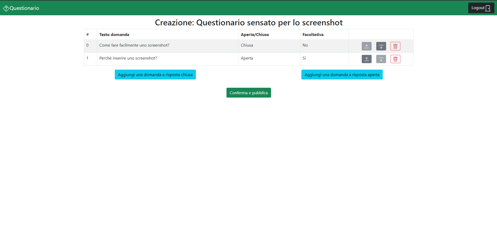

# Exam #1: "Questionario"
## Student: s290225 TRUNGADI PAOLO 

## React Client Application Routes

- Route `/`: Pagina principale, visualizzazione tutti questionari compilabili se non loggedIn, altrimenti visualizzazione propri questionari.
- Route `/Questionario/:id`: pagina per la compilazione del questionario identificato da `id`.
- Route `/VisualizzaQuestionario/:id`: pagina riservata ad un admin in cui visualizzare le compilazioni del questionario identificato da `id`.
- Route `/CreazioneQuestionario`: pagina riservata ad un admin in cui creare un nuovo questionario.


## API Server

#### POST `/api/session`
- request parameters: credenziali dell'admin che vuole fare login
- request body content: 
    ``` JSON
    {
        "username": "username",
        "password": "password"
    }
    ```
- response body content:
    ``` JSON
    {
        "id": 1,
        "username": "John"
    }
    ```

#### GET `/api/sessions/current`
- request parameters: utente attuale di cui verificare la registrazione.
- request body content: _Non presente_
- response body content:
    ``` JSON
    {
        "id": 1,
        "username": "john.doe@polito.it", 
        "name": "John"
    }
    ```

#### DELETE `/api/sessions/current`
- request parameters: _Non presente_
- request body content: _Non presente_
- response body content: _Non presente_


#### GET `/api/qs`
  - request parameters: adminId (optional)
  - response body content:
    ``` JSON
    [
      {
        "id": 4,
        "name": "Questionario 1",
        "authId": 1,
        "ncompilazioni": 1,
        "authName": "WebApp"
      },
      ...
    ]
    ```

#### GET `/api/ds`
  - request parameters: qId - id del questionario di cui prendere le domande
  - response body content:
    ``` JSON
    [
      {
        "id": 4,
        "text": "Una domanda a risposta chiusa obbligatoria",
        "qId": 4,
        "min": 2,
        "max": 2,
        "close": 1,
        "ordine":0
      },
      ...
    ]
    ```

#### GET `/api/rs`
  - request parameters: qId,user - id del questionario e utente di cui prendere le risposte
  - response body content:
    ``` JSON
    [
      {
        "id": 1,
        "text": "Non si può scegliere",
        "qId": 4,
        "user":"Utente 1"
      },
      ...
    ]
    ```

#### GET `/api/mulr`
  - request parameters: dId - id della domanda chiusa di cui prendere le possibili risposte multiple
  - response body content:
    ``` JSON
    [
      "Non si può scegliere",
      ...
    ]
    ```

#### GET `/api/ucompilazioni`
  - request parameters: qId - id del questionario di cui prendere gli utenti che lo hanno compilato
  - response body content:
    ``` JSON
    [
      "Utente 1",
      ...
    ]
    ```
    
#### POST `/api/q`
  - request parameters: Questionario da aggiungere
  - request body content: 
    ``` JSON
    [
      {
        "name": "Questionario 1",
        "authId": 1,
        "ncompilazioni": 1,
        "authName": "WebApp"
      }
    ]
    ```
  - response body content:
    ``` JSON
    [
      {
        "id": 4,
      }
    ]
    ```

#### POST `/api/d`
  - request parameters: Domanda da aggiungere
  - request body content: 
    ``` JSON
    [
      {
        "text": "Una domanda a risposta chiusa obbligatoria",
        "qId": 4,
        "min": 2,
        "max": 2,
        "close": 1,
        "ordine":0
      }
    ]
    ```
  - response body content:
    ``` JSON
    [
      {
        "id": 4,
      }
    ]
    ```

#### POST `/api/r`
  - request parameters: Risposta da aggiungere
  - request body content: 
    ``` JSON
    [
      {
        "text": "Non si può scegliere",
        "qId": 4,
        "user":"Utente 1"
      }
    ]
    ```
  - response body content: Non presente.

#### POST `/api/rmultiple`
  - request parameters: Possibile risposta di una domanda chiusa da aggiungere
  - request body content: 
    ``` JSON
    [
      {
        "text": "Non si può scegliere",
        "dId": 4
      }
    ]
    ```
  - response body content: Non presente.

#### POST `/api/compilazione`
  - request parameters: Id questionario e utente che l'ha compilato
  - request body content: 
    ``` JSON
    [
      {
        "qId": 4,
        "user":"Utente 1"
      }
    ]
    ```
  - response body content: Non presente.

#### POST `/api/compilazioneQ`
  - request parameters: Id questionario di cui incrementare il numero di compilazioni effettuate
  - request body content: 
    ``` JSON
    [
      {
        "qId": 4
      }
    ]
    ```
  - response body content: Non presente.


## Database Tables

- Table `admins` - per ogni admin contiene id, username e hash della password.
- Table `questionari` - per ogni questionario contiene id, nome, id e nome dell'admin autore e numero compilazioni.
- Table `domande` - per ogni domanda contiene id, testo, id questionario di appartenenza e parametri min/max/facoltativa e ordine (relativo al questionario). 
- Table `risposte` - per ogni risposta contiene id, testo, id questionario e domanda di appartenenza e utente autore.
- Table `rispostemultiple` - contiene il testo della possibile risposta chiusa e l'id della domanda a cui appartiene.
- Table `compilazioni` - tiene traccia delle compilazioni di un questionario abbinando l'id del questionario al nome dell'utente che lo ha compilato.


## Main React Components

- `MyNavBar` (in `MyNavbar.js`): Navbar personalizzata.
- `MyPage` (in `MyPage.js`): Scheletro della pagina al di sotto della navbar.
- `MyCardDeck` (in `MyCard.js`): Componente per la visualizzazione dei questionari come Cards.
- `CompilaQ` (in `q.js`): Componente per la pagina di compilazione questionario.
- `CreaQ` (in `q.js`): Componente per la pagina di creazione questionario.
- `VisualizzaQ` (in `q.js`): Componente per la pagina di visualizzazione delle compilazioni di un questionario.
- `OpenQForm` (in `MyForms.js`): Componente per il modale di aggiunta domanda aperta.
- `CloseQForm` (in `MyForms.js`): Componente per il modale di aggiunta domanda chiusa.


## Screenshot



## Users Credentials

- WebApp - password 
- Admin - password 
